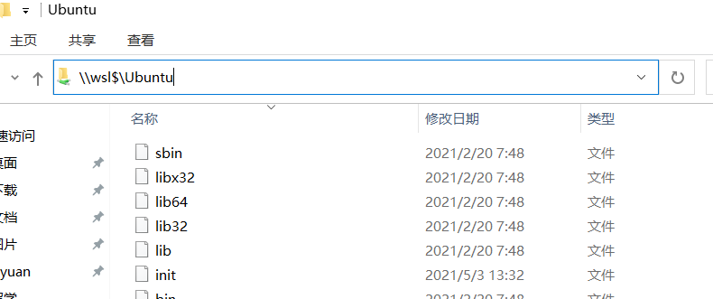

# MSoCS 基础环境配置与准备

> 顾真榕 GitHub: [@endaytrer](https://github.com/endaytrer)

[TOC]

##  Linux环境

如何简单地配置Linux的环境? 考虑到大家使用的不同系统, 以下会有3种解决方案.

下面给出的解决方案并不是必须的, 甚至不是最好的. 有条件的同学可以自行摸索安装win/mac-Linux双系统 (给你最纯粹的Linux体验), 或者在自己的平台上通过VMWare Workstation, VMWare Fusion, Parallels Desktop或VirtualBox安装Linux虚拟机, 无论是流畅度还是完整性都至少比WSL要好.

### for PC

Microsoft给我们提供了很好的Linux解决方案: **WSL(Windows Subsystem for Linux)**.

WSL并不是一个Linux, 因为他并没有Linux的内核代码. 但是, WSL仍给在Windows上运行Linux程序等提供了很好的解决方案.

本教程推荐使用WSL2和Ubuntu 20.04作为环境.

**启用WSL**

0. 保证你的Windows 10版本在1903以上

1. **管理员**身份运行PowerShell, 并运行:

    ```powershell
    dism.exe /online /enable-feature /featurename:Microsoft-Windows-Subsystem-Linux /all /norestart
    dism.exe /online /enable-feature /featurename:VirtualMachinePlatform /all /norestart
    ```

2. **重启系统**，关机后系统会显示正在更新。该过程大约耗时3分钟。

3. 下载内核更新包

    下载地址: https://wslstorestorage.blob.core.windows.net/wslblob/wsl_update_x64.msi

4. 使用版本WSL2

    ```powershell
    wsl --set-default-version 2
    ```

5. 下载Linux分发版:

    1. 在Windows应用商店中选择合适的分发版.
        - 我们推荐按照自己的喜好选择. 若暂时没有, 我们接下来会使用 [Ubuntu 20.04LTS](https://www.microsoft.com/zh-cn/p/ubuntu/9nblggh4msv6?activetab=pivot:overviewtab) 为例子, 但该版本对WSL的兼容性不佳. 使用Ubuntu 18.04也是好的选择.
    2. 从开始菜单或应用商店中启动 Ubuntu
    3. 按照英文设定用户名和密码
    4. 配置完成！

6. 安装好之后，如果你需要访问 wsl 的文件，可以在文件管理器中输入`\\wsl$\Ubuntu` （或 `\\wsl$\`）查看 Linux 的文件。建议把 `\\wsl$\Ubuntu\home\<你的用户名>` 路径”固定到快速访问中“（右键该文件夹，选择固定到快速访问中）。`\\wsl$\Ubuntu` 路径是根目录， `\\wsl$\Ubuntu\home\<你的用户名>` 路径是你的用户目录，后文的文件系统一节会详细介绍。

    

    

7. 安装 [WIndows Terminal](https://www.microsoft.com/zh-cn/p/windows-terminal/9n0dx20hk701#activetab=pivot:overviewtab) (可选, 但**推荐**)

    如果你愿意一直和 Powershell 原生界面一直打交道, 这一步可以跳过.

    在应用商店下载即可. 安装之后启动，默认终端是 Powershell ，点击窗口左上角的向下箭头，点击 Ubuntu 即可启动 Ubuntu 的命令行

    Windows Terminal没有图形化设置界面, 具体怎么使Windows Terminal 更好看, 可以先百度自学, 或者等到之后学习完 Json 之后配置.

**详细教程可以参考微软官网** https://docs.microsoft.com/zh-cn/windows/wsl/install-win10#step-3---enable-virtual-machine-feature
### for Mac

恭喜你! 你已经拥有了一套`Unix-like`系统!

什么是`Unix-like`? 你只需要知道macOS和Linux在图上足够接近就行.

你的系统和Linux已经有98%*的相似度; 接下来会介绍其中1%的不同和相应的补救措施. 如果不进行如下操作, 对之后的学习过程影响不是很大, **但强烈建议安装**. 另外1%的不同, 本教程的核心部分不会涉及到.

#### 下载XCode CLT (Command Line Tools)

XCode CLT是使用Mac编程的必要条件. 可以通过XCode安装, 也可以直接使用命令行.

打开你的终端, 输入如下命令:

```bash
xcode-select --install
```

#### 下载HomeBrew

HomeBrew是macOS平台上最受欢迎的包管理工具.

什么是包管理? 先接受他.

**需翻墙**

什么是墙

打开你的终端, 然后输入以下命令:

1. 设置VPN HTTP/ HTTPS全局代理(下面的命令暂时不知道什么意思没有关系, 可以自行进行学习)

    - 纸飞机 (其他的类似, 只要你能找到http代理开关和端口):

        

    - 然后你会得到类似语句

        ```bash
        export http_proxy=http://127.0.0.1:1087;export https_proxy=http://127.0.0.1:1087;
        ```

        在终端中执行即可. (非永久)

    - 永久: **不推荐** (当然你可以写脚本来进行开关)

        ```bash
        
        echo "export http_proxy=http://127.0.0.1:1087;export https_proxy=http://127.0.0.1:1087;" >> ~/.bash_profile # zsh用户须改成 ~/.zshrc
        source ~/.bash_profile # zsh用户须改成 ~/.zshrc
        ```

2. 执行命令

```bash
/bin/bash -c "$(curl -fsSL https://raw.githubusercontent.com/Homebrew/install/HEAD/install.sh)"
```

**无需翻墙 (清华源):**

1. 设置环境变量

    ```bash
    if [[ "$(uname -s)" == "Linux" ]]; then BREW_TYPE="linuxbrew"; else BREW_TYPE="homebrew"; fi
    export HOMEBREW_BREW_GIT_REMOTE="https://mirrors.tuna.tsinghua.edu.cn/git/homebrew/brew.git"
    export HOMEBREW_CORE_GIT_REMOTE="https://mirrors.tuna.tsinghua.edu.cn/git/homebrew/${BREW_TYPE}-core.git"
    export HOMEBREW_BOTTLE_DOMAIN="https://mirrors.tuna.tsinghua.edu.cn/${BREW_TYPE}-bottles"
    ```

2. 下载和安装

    ```bash
    git clone --depth=1 https://mirrors.tuna.tsinghua.edu.cn/git/homebrew/install.git brew-install
    /bin/bash brew-install/install.sh
    rm -rf brew-install
    ```

3. 环境变量(**当且仅当采用Apple Silicon芯片(M1, etc)的设备需要进行, 其他设备切勿进行**)

    ```bash
    test -r ~/.bash_profile && echo 'eval "$(/opt/homebrew/bin/brew shellenv)"' >> ~/.bash_profile
    test -r ~/.zprofile && echo 'eval "$(/opt/homebrew/bin/brew shellenv)"' >> ~/.zprofile
    ```

4. 换源

    ```bash
    git -C "$(brew --repo)" remote set-url origin https://mirrors.tuna.tsinghua.edu.cn/git/homebrew/brew.git
    git -C "$(brew --repo homebrew/core)" remote set-url origin https://mirrors.tuna.tsinghua.edu.cn/git/homebrew/homebrew-core.git
    git -C "$(brew --repo homebrew/cask)" remote set-url origin https://mirrors.tuna.tsinghua.edu.cn/git/homebrew/homebrew-cask.git
    git -C "$(brew --repo homebrew/cask-fonts)" remote set-url origin https://mirrors.tuna.tsinghua.edu.cn/git/homebrew/homebrew-cask-fonts.git
    git -C "$(brew --repo homebrew/cask-drivers)" remote set-url origin https://mirrors.tuna.tsinghua.edu.cn/git/homebrew/homebrew-cask-drivers.git
    git -C "$(brew --repo homebrew/cask-versions)" remote set-url origin https://mirrors.tuna.tsinghua.edu.cn/git/homebrew/homebrew-cask-versions.git
    brew update-reset
    ```

5. 若想要恢复原源 (**不具备翻墙条件时请勿使用**):

    ```bash
    git -C "$(brew --repo)" remote set-url origin https://github.com/Homebrew/brew.git
    BREW_TAPS="$(brew tap)"
    for tap in core cask{,-fonts,-drivers,-versions}; do
        if echo "$BREW_TAPS" | grep -qE "^homebrew/${tap}\$"; then
            git -C "$(brew --repo homebrew/${tap})" remote set-url origin https://github.com/Homebrew/homebrew-${tap}.git
        fi
    done
    brew update-reset
    ```

### for Linux

恭喜你! 你不需要进行任何操作.


### Additional: 安装zsh, 插件和主题

Zsh是另一种shell版本, 是bash的一种替代. [shell是什么? shell, 终端(Terminal), 控制台(Console), 还有进入shell之后出现的tty(Teletypewriter)这几个好像是一个意思的概念, 分别是什么意思?](https://www.zhihu.com/question/21711307)

安装zsh不是必须的, 有些脚本的语法甚至和bash不同, 但是他可以提供命令补全等实用功能; 同时, 如果你们想追求一个更美观的shell界面, 可以选择安装zsh.

安装方式很简单:

(其他的包管理应该也可以找到)

```bash
sudo apt install zsh # ubuntu
brew install zsh # macOS
```

你还需要将zsh设为默认shell.

```bash
chsh -s /bin/zsh
```

zsh最著名的插件是oh-my-zsh([网址](https://ohmyz.sh/)), 他是一个zsh插件管理工具. 

安装方式(需翻墙):

```bash
sh -c "$(curl -fsSL https://raw.github.com/ohmyzsh/ohmyzsh/master/tools/install.sh)"
```

安装结束后你的终端界面会好看很多. 


同时也可以安装主题. 几个推荐的主题(我使用的是自带的主题):

- Powerlevel10k (https://github.com/romkatv/powerlevel10k)
- Spaceship Prompt (https://github.com/denysdovhan/spaceship-prompt)

推荐可以安装以下几个插件, 能够极大方便你的zsh使用体验

1. Autojump (https://github.com/wting/autojump)

    该插件可以通过学习你的bash使用, 让`j`命令自动适配你想进入的目录, 省去疯狂cd的痛苦.

    

2. zsh-autosuggestions

    该插件自动根据之前的命令显示提示, 按方向键右补全.

    

    

3. zsh-syntax-highlighting

    该插件会高亮shell保留字, 内置指令和程序、$PATH下的程序名称

    
    
    

完成如上操作后, 你已经拥有一个可以使用的 (相当于) Linux系统了.

对于Mac和Linux, 打开终端, 就可以见到Shell命令行界面(一般是Bash)了.

对于Windows, 在Windows Terminal中在加号下拉菜单中选择你的发行版, 就可以使用$WSL2$了.

