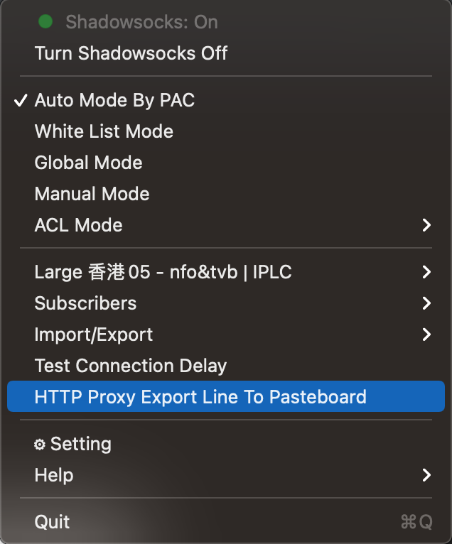
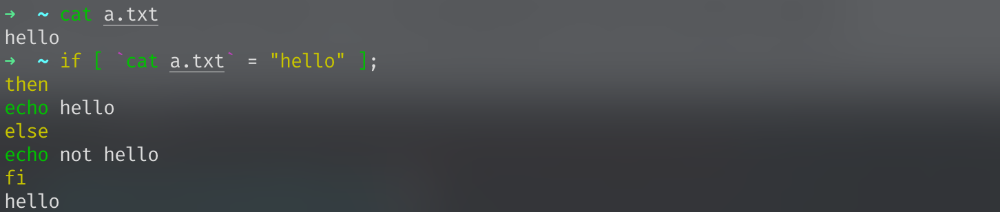

# 基础环境准备和基本Linux命令

> 顾真榕 GitHub: [@endaytrer](https://github.com/endaytrer)

[TOC]

## 1. Linux环境

如何简单地配置Linux的环境? 考虑到大家使用的不同系统, 以下会有3种解决方案.

下面给出的解决方案并不是必须的, 甚至不是最好的. 有条件的同学可以自行摸索安装win/mac-Linux双系统 (给你最纯粹的Linux体验), 或者在自己的平台上通过VMWare Workstation, VMWare Fusion, Parallels Desktop或VirtualBox安装Linux虚拟机, 无论是流畅度还是完整性都至少比WSL要好.

### for PC

Microsoft给我们提供了很好的Linux解决方案: **WSL(Windows Subsystem for Linux)**.

WSL并不是一个Linux, 因为他并没有Linux的内核代码. 但是, WSL仍给在Windows上运行Linux程序等提供了很好的解决方案.

本教程推荐使用WSL2和Ubuntu 20.04作为环境.

**启用WSL**

0. 保证你的Windows 10版本在1903以上

1. **管理员**身份运行PowerShell, 并运行:

    ```powershell
    dism.exe /online /enable-feature /featurename:Microsoft-Windows-Subsystem-Linux /all /norestart
    dism.exe /online /enable-feature /featurename:VirtualMachinePlatform /all /norestart
    ```

2. **重启系统**，关机后系统会显示正在更新。该过程大约耗时3分钟。

3. 下载内核更新包

    下载地址: https://wslstorestorage.blob.core.windows.net/wslblob/wsl_update_x64.msi

4. 使用版本WSL2

    ```powershell
    wsl --set-default-version 2
    ```

5. 下载Linux分发版:

    1. 在Windows应用商店中选择合适的分发版.
        - 我们推荐按照自己的喜好选择. 若暂时没有, 我们接下来会使用 [Ubuntu 20.04LTS](https://www.microsoft.com/zh-cn/p/ubuntu/9nblggh4msv6?activetab=pivot:overviewtab) 为例子, 但该版本对WSL的兼容性不佳. 使用Ubuntu 18.04也是好的选择.
    2. 从开始菜单或应用商店中启动 Ubuntu
    3. 按照英文设定用户名和密码
    4. 配置完成！

6. 安装好之后，如果你需要访问 wsl 的文件，可以在文件管理器中输入`\\wsl$\Ubuntu` （或 `\\wsl$\`）查看 Linux 的文件。建议把 `\\wsl$\Ubuntu\home\<你的用户名>` 路径”固定到快速访问中“（右键该文件夹，选择固定到快速访问中）。`\\wsl$\Ubuntu` 路径是根目录， `\\wsl$\Ubuntu\home\<你的用户名>` 路径是你的用户目录，后文的文件系统一节会详细介绍。

    

7. 安装 [WIndows Terminal](https://www.microsoft.com/zh-cn/p/windows-terminal/9n0dx20hk701#activetab=pivot:overviewtab) (可选, 但**推荐**)

    如果你愿意一直和 Powershell 原生界面一直打交道, 这一步可以跳过.

    在应用商店下载即可. 安装之后启动，默认终端是 Powershell ，点击窗口左上角的向下箭头，点击 Ubuntu 即可启动 Ubuntu 的命令行
    
    Windows Terminal没有图形化设置界面, 具体怎么使Windows Terminal 更好看, 可以先百度自学, 或者等到之后学习完 Json 之后配置.

**详细教程可以参考微软官网** https://docs.microsoft.com/zh-cn/windows/wsl/install-win10#step-3---enable-virtual-machine-feature

### for Mac

恭喜你! 你已经拥有了一套`Unix-like`系统!

什么是`Unix-like`? 你只需要知道macOS和Linux在图上足够接近就行.

你的系统和Linux已经有98%*的相似度; 接下来会介绍其中1%的不同和相应的补救措施. 如果不进行如下操作, 对之后的学习过程影响不是很大, **但强烈建议安装**. 另外1%的不同, 本教程的核心部分不会涉及到.

#### 下载XCode CLT (Command Line Tools)

XCode CLT是使用Mac编程的必要条件. 可以通过XCode安装, 也可以直接使用命令行.

打开你的终端, 输入如下命令:

```bash
xcode-select --install
```

#### 下载HomeBrew

HomeBrew是macOS平台上最受欢迎的包管理工具.

什么是包管理? 先接受他.

**需翻墙**

什么是墙

打开你的终端, 然后输入以下命令:

1. 设置VPN HTTP/ HTTPS全局代理(下面的命令暂时不知道什么意思没有关系, 可以自行进行学习)

    - 纸飞机 (其他的类似, 只要你能找到http代理开关和端口):

        

    - 然后你会得到类似语句

        ```bash
        export http_proxy=http://127.0.0.1:1087;export https_proxy=http://127.0.0.1:1087;
        ```

        在终端中执行即可. (非永久)

    - 永久: **不推荐** (当然你可以写脚本来进行开关)

        ```bash
        
        echo "export http_proxy=http://127.0.0.1:1087;export https_proxy=http://127.0.0.1:1087;" >> ~/.bash_profile # zsh用户须改成 ~/.zshrc
        source ~/.bash_profile # zsh用户须改成 ~/.zshrc
        ```

2. 执行命令

```bash
/bin/bash -c "$(curl -fsSL https://raw.githubusercontent.com/Homebrew/install/HEAD/install.sh)"
```

**无需翻墙 (清华源):**

1. 设置环境变量

    ```bash
    if [[ "$(uname -s)" == "Linux" ]]; then BREW_TYPE="linuxbrew"; else BREW_TYPE="homebrew"; fi
    export HOMEBREW_BREW_GIT_REMOTE="https://mirrors.tuna.tsinghua.edu.cn/git/homebrew/brew.git"
    export HOMEBREW_CORE_GIT_REMOTE="https://mirrors.tuna.tsinghua.edu.cn/git/homebrew/${BREW_TYPE}-core.git"
    export HOMEBREW_BOTTLE_DOMAIN="https://mirrors.tuna.tsinghua.edu.cn/${BREW_TYPE}-bottles"
    ```

2. 下载和安装

    ```bash
    git clone --depth=1 https://mirrors.tuna.tsinghua.edu.cn/git/homebrew/install.git brew-install
    /bin/bash brew-install/install.sh
    rm -rf brew-install
    ```

3. 环境变量(**当且仅当采用Apple Silicon芯片(M1, etc)的设备需要进行, 其他设备切勿进行**)

    ```bash
    test -r ~/.bash_profile && echo 'eval "$(/opt/homebrew/bin/brew shellenv)"' >> ~/.bash_profile
    test -r ~/.zprofile && echo 'eval "$(/opt/homebrew/bin/brew shellenv)"' >> ~/.zprofile
    ```

4. 换源

    ```bash
    git -C "$(brew --repo)" remote set-url origin https://mirrors.tuna.tsinghua.edu.cn/git/homebrew/brew.git
    git -C "$(brew --repo homebrew/core)" remote set-url origin https://mirrors.tuna.tsinghua.edu.cn/git/homebrew/homebrew-core.git
    git -C "$(brew --repo homebrew/cask)" remote set-url origin https://mirrors.tuna.tsinghua.edu.cn/git/homebrew/homebrew-cask.git
    git -C "$(brew --repo homebrew/cask-fonts)" remote set-url origin https://mirrors.tuna.tsinghua.edu.cn/git/homebrew/homebrew-cask-fonts.git
    git -C "$(brew --repo homebrew/cask-drivers)" remote set-url origin https://mirrors.tuna.tsinghua.edu.cn/git/homebrew/homebrew-cask-drivers.git
    git -C "$(brew --repo homebrew/cask-versions)" remote set-url origin https://mirrors.tuna.tsinghua.edu.cn/git/homebrew/homebrew-cask-versions.git
    brew update-reset
    ```

5. 若想要恢复原源 (**不具备翻墙条件时请勿使用**):

    ```bash
    git -C "$(brew --repo)" remote set-url origin https://github.com/Homebrew/brew.git
    BREW_TAPS="$(brew tap)"
    for tap in core cask{,-fonts,-drivers,-versions}; do
        if echo "$BREW_TAPS" | grep -qE "^homebrew/${tap}\$"; then
            git -C "$(brew --repo homebrew/${tap})" remote set-url origin https://github.com/Homebrew/homebrew-${tap}.git
        fi
    done
    brew update-reset
    ```

### for Linux

恭喜你! 你不需要进行任何操作.


### Additional: 安装zsh, 插件和主题

Zsh是另一种shell版本, 是bash的一种替代. [shell是什么? shell, 终端(Terminal), 控制台(Console), 还有进入shell之后出现的tty(Teletypewriter)这几个好像是一个意思的概念, 分别是什么意思?](https://www.zhihu.com/question/21711307)

安装zsh不是必须的, 有些脚本的语法甚至和bash不同, 但是他可以提供命令补全等实用功能; 同时, 如果你们想追求一个更美观的shell界面, 可以选择安装zsh.

安装方式很简单:

(其他的包管理应该也可以找到)

```bash
sudo apt install zsh # ubuntu
brew install zsh # macOS
```

你还需要将zsh设为默认shell.

```bash
chsh -s /bin/zsh
```

zsh最著名的插件是oh-my-zsh([网址](https://ohmyz.sh/)), 他是一个zsh插件管理工具. 

安装方式(需翻墙):

```bash
sh -c "$(curl -fsSL https://raw.github.com/ohmyzsh/ohmyzsh/master/tools/install.sh)"
```

安装结束后你的终端界面会好看很多. 


同时也可以安装主题. 几个推荐的主题(我使用的是自带的主题):

- Powerlevel10k (https://github.com/romkatv/powerlevel10k)
- Spaceship Prompt (https://github.com/denysdovhan/spaceship-prompt)

推荐可以安装以下几个插件, 能够极大方便你的zsh使用体验

1. Autojump (https://github.com/wting/autojump)

    该插件可以通过学习你的bash使用, 让`j`命令自动适配你想进入的目录, 省去疯狂cd的痛苦.

    

2. zsh-autosuggestions

    该插件自动根据之前的命令显示提示, 按方向键右补全.

    

    

3. zsh-syntax-highlighting

    该插件会高亮shell保留字, 内置指令和程序、$PATH下的程序名称

    

## 2. Linux基础方面

完成如上操作后, 你已经拥有一个可以使用的 (相当于) Linux系统了.

对于Mac和Linux, 打开终端, 就可以见到Shell命令行界面(一般是Bash)了.

对于Windows, 在Windows Terminal中在加号下拉菜单中选择你的发行版, 就可以使用WSL了.

### 文件系统

Linux不同于Windows以分区为基础的文件系统. 所有的文件都是**根目录`/`**的子孙.

比方说, 你的Windows用户目录是这样:

```
C:\Users\Me\
```

在其他分卷中的某个文件夹是这样:

```
D:\path\to\the\folder
```

而在Linux中, 用户目录是这样:

```bash
/home/me
~
/Users/me # macOS
```

其他分卷的文件(不推荐在其他分卷进行操作)

```bash
/mnt/d/path/to/the/folder # windows wsl
/Volumes/Data/path/to/the/folder # macOS
```

显著的特点:

1. Windows是反斜杠, 而Linux是正斜杠. 这点避免了'\\'在转义的时候被吞掉的问题
2. 通过`~`指代用户目录
3. 通过`/`指代根目录

其他重要的点

1. 用`.`指代当前目录
2. 用`..`指代上级目录. 根目录的上级目录是根目录

例: 当前你在`/home/me/path/to/file/a/content/`, 若想要在这个语境下表示路径`/home/me/path/to/file/b/content/a.txt`, 你可以有以下几种表示方法:

1. 从根目录开始计算: `/home/me/path/to/file/b/content/a.txt`. 此路径称为**绝对路径**
2. 从用户目录开始计算: `~/path/to/file/b/content/a.txt`
3. 从当前目录开始计算: `../../b/content/a.txt`. 此路径称为**相对路径**. 表示同一个文件夹下的内容是, 可以省略`./`. 例: `path` = `./path`; 但若要运行目录下的二进制文件, 必须使用`./`.
4. 胡乱表示: `./.././../a/../b/./content/../content/a.txt` 只要推过去对就行

linux隐藏文件名以`.`开头, 这就是为什么Minecraft的内容文件夹叫`.minecraft`.

> **自测1.1**
>
> 这是一个linux系统的部分文件树.
>
> ```
> /(root)
> |-	home
> |	 |- user1
> |	 |   |-	a 
> |	 |	 |	 |-.abc # 选项A
> |	 |   |- .a.abc # 选项B
> |	 |- user2
> |	     |-	a.abc # 选项C
> |	     |- .a.abc # 选项D
> |-	dir
> |	 |- a # 选项E
> |	 |- a.abc # 选项F
> |	 |- .a # 选项G
> |	 	 |-.abc # 选项H
> |-	a.abc # 选项I
> |- .a.abc # 选项J
> ```
>
> 你的用户名是user1, 目前处于/dir/的位置上. 以下路径分别表示什么? 写出路径在上述文件树上的位置# 后面的选项名称
>
> 1. `.a`
> 2. `./a`
> 3. `.a/.abc`
> 4. `./a.abc`
> 5. `/.a.abc`
> 6. `../a.abc`
> 7. `~/a/.abc`
> 8. `~/.a.abc`
>
> 答案在文末.


#### `pwd` (Present Working Directory)

若你想获取当前路径是什么 (绝对路径表示), 使用`pwd`即可

> 注: 示例中`user@device ~$ `是bash默认输出的内容, 若想自己试一试, 仅需输入`pwd`即可; 不带该前缀的, 是输出的结果.

**例**

```bash
user@device ~$ pwd
/home/user

user@device /$ pwd
/
```

#### `cd` (Change Directory)

若你想前往一个路径, 使用`cd ${pathTo} `即可. pathTo可以是上述提到的任何一种形式. 直接使用`cd`会回到用户目录. 在输入一半后, 你可以按下tab来查看符合输入条件的目录; 若只有一个匹配项, 就会帮你补全. 如果你使用了zsh, 你会在匹配项中toggle.

**例**

```bash
user@device ~$ pwd
/home/user
user@device ~$ cd ..
user@device /home$ pwd
/home
user@device /home$ cd ..
user@device /$ pwd
/
user@device /$ cd home/user/folder
user@device /home/user/folder
```

**建议在自己的设备上多试试**, 这样你就可以在控制台中灵活地前往文件夹.

#### `ls` (LiSt)

若你想列出路径下的所有文件和文件夹(不包括隐藏文件), 使用`ls `即可; 若需要包括隐藏文件, 使用`ls -a`可列出包括隐藏文件的所有文件. `ls ${path}`可列出`path`下所有文件和文件夹; `ls *.txt`则可以列出本目录下的所有txt文件. 这里的*称为**通配符**, 代表任意字符. 具体有关通配符的事项可以查看[百度百科](https://baike.baidu.com/item/%E9%80%9A%E9%85%8D%E7%AC%A6).

`ls -a`里的`-a`我们称为option. option是程序定义的, 但一般服从以下规则:

带有一个减号的, 后面跟首字母; 带有两个减号的后面跟单词.

带有一个减号的options若想同时使用, 可以仅输入一个减号, 然后在后面连续跟options的字母.

一般的程序可能都带有一下的option:

`-v, --version`: 展示程序版本

`-h --help`: 获取帮助

**例**

```bash
user@device ~$ ls
dir1		dir2		dir3		a		a.txt
user@device ~$ ls -a
.		..		.ssh		.vscode		.oh-my-zsh		.zshrc		a			a.txt		dir1		dir2		dir3
user@device ~$ ls -a /
.     	cdrom  	initrd.img      		lost+found  	proc  		snap      	tmp      	vmlinuz.old
..    	dev    	initrd.img.old  		media       	root  		srv       	usr
bin   	etc    	lib             		mnt         	run   		swapfile  	var
boot  	home   	lib64           		opt         	sbin  		sys       	vmlinuz
```

**建议在自己的设备上多试试**, 这样你就可以在控制台中灵活地前往文件夹

#### `mkdir` (MaKe DIRectory)

若你想在工作路径下新建文件夹, 使用`mkdir ${folderName} `即可. 也可以在指定工作路径中新件文件夹, 用法: `mkdir ${directory}/${folderName}`

如果`${directory}`不存在, 使用`mkdir`命令会报错. 如果你想用一个命令在新建的文件夹内递归地新建文件夹怎么办? 在后面跟一个option`-p`即可. 这样就会在相应路径新建文件夹; 若路径不存在则创建.

**例**

```bash
user@device ~$ ls
dir1		dir2		dir3		a		a.txt
user@device ~$ mkdir -p b/e
user@device ~$ mkdir c
user@device ~$ ls
dir1		dir2		dir3		b		c		a		a.txt
user@device ~$ cd b
user@device ~/b$ ls
e
user@device ~/b$ pwd
/home/user/b
```

#### `touch`

新建文件, 和mkdir用法类似

```bash
user@device ~$ ls
dir1		dir2		dir3		a		a.txt
user@device ~$ touch b
user@device ~$ touch c
user@device ~$ touch a/c
user@device ~$ ls
dir1		dir2		dir3		a		a.txt		b		c

user@device ~$ cd a
user@device ~/a$ ls
c
```

#### `rm`

删除文件. 用法: `rm ${file}`.

也可加`-r`进行递归删除, 加`-f`强制删除. 组合`rm -rf`一般用于删除文件或文件夹.

```bash
user@device ~$ ls
dir1		dir2		dir3		a		a.txt
user@device ~$ rm a.txt
user@device ~$ rm -r dir3
user@device ~$ ls
dir1		dir2		a

user@device ~$ rm -f a
user@device ~/a$ ls
dir1		dir2
```

#### `cat ` (conCATenate)

cat命令用于输出文件内容. 用法: `cat ${file}`. 

**例**

```
# a.txt
hello world
```

```bash
user@device ~/dir$ cat a.txt
hello world

user@device ~/dir$ cat ~/.ssh/authorized_keys
ssh-rsa ********
ssh-rsa ********
```

#### `echo` 

输入一个内容, 并输出.

echo命令经常和`>`, `>>`连用. `echo something > file`意为将something覆盖到file文件上, 若不存在则会创建, `echo something >> file`意为将something追加到file中.

**例**

```bash
user@device ~$ echo hello world
hello world
user@device ~$ cat a
hello world
user@device ~$ echo hello again > a
user@device ~$ cat a
hello again
user@device ~$ echo hello again >> a
user@device ~$ cat a
hello again
hello again
```

#### `clear`

清除屏幕.

#### `sudo` (Super User DO)

用超级管理员的模式完成一件事情.

为什么要用sudo?

在`ls`中, 我们仅讲解了基本用法. `ls`也可以带有一定的options. 你若加了`-al`, 或者使用`ll`, 你会获得如下信息.

```bash
user@device:~$ ll
总用量 11876
drwxr-xr-x 21 user user     4096 Mar 10 22:55 ./
drwxr-xr-x  3 root root     4096 Mar  4 20:07 ../
-rw-------  1 user user     1204 Mar  4 21:49 .ICEauthority
-rw-------  1 user user      144 Mar  4 23:37 .Xauthority
-rw-------  1 user user     5311 Mar 21 17:30 .bash_history
-rw-r--r--  1 user user      220 Mar  4 20:07 .bash_logout
-rw-r--r--  1 user user     3771 Mar  4 20:07 .bashrc
drwx------ 15 user user     4096 Mar 10 22:55 .cache/
drwx------ 15 user user     4096 Mar  9 08:41 .config/
-rw-rw-r--  1 user user       54 Mar  9 18:34 .gitconfig
drwx------  3 user user     4096 Mar  4 20:28 .gnupg/
drwx------  3 user user     4096 Mar  4 20:28 .local/
-rw-------  1 user user      147 Mar  5 00:13 .mysql_history
drwxrwxr-x  5 user user     4096 Mar 10 23:01 .npm/
-rw-r--r--  1 user user      807 Mar  4 20:07 .profile
drwxr-xr-x  2 user user     4096 Mar 20 16:30 .ssh/
-rw-------  1 user user    13902 Mar 10 18:10 .viminfo
drwxrwxr-x  5 user user     4096 Mar 10 22:55 .vscode-server/
-rw-rw-r--  1 user user      183 Mar 10 22:55 .wget-hsts
-rw-------  1 user user 11948032 Mar  5 22:44 core
drwxr-xr-x  5 user user     4096 Mar  5 00:21 dist/
drwxrwxr-x  3 user user     4096 Mar  5 01:03 logs/
drwxr-xr-x 15 user user     4096 Mar 10 18:06 yi-dian-saving/
```

可以看见, 前面有这样的字符串:

```
d | r w x | r w x | r w x
0   1 2 3   4 5 6   7 8 9
```


第0位d表示它是一个文件夹; 若是`-`, 则是单文件, 若是l, 则是链接(感兴趣可以自己查找).

第1位至第3位是创建者权限. r (Readable)代表可读, w (Writable) 代表可写, x (eXecutable)代表可运行. 例如: `r-w`代表只读并可运行, `rw-`代表不可执行.

第4位至第6位是创建者所在用户组权限.

第7位至第9位是其他用户权限.

用户, 顾名思义, 是使用者; 用户组, 顾名思义, 是用户的集合.

如何查看文件是那个用户创建和他所在的组是什么呢?

例如:

```
drwx------ 15 user user     4096 Mar  9 08:41 .config/
              用户 用户组
```

第一个user就是创建者的用户, 第二个则是用户组. 可见这个文件夹对user这个用户是开放权限的, 而对其他用户则是不可读不可写不可运行.

对于某些文件或文件夹, 作为普通用户user, 我们是无法得到全部权限的, 例如:`/bin/`

```
drwxr-xr-x   2 root root    4096 Mar   4 23:19 bin/
```

什么是root?

root是linux上的超级管理员, 和Windows上的Administrator类似. 他的用户文件夹位置与其他用户都不同 -- 其他用户的用户文件夹是`/home/username/`, 而root用户则是`/root/`. 很多根目录下的文件和文件夹都是root创建的, 若需要修改他们 (包括安装程序, 因为需要修改在`/bin`, `/usr/bin`, `/usr/local/bin`, `/lib`, `/etc`等目录下的内容), 你必须获得root权限. 暂时地获得root权限的命令就是sudo. 用法: `sudo 任何命令`

若你使用的用户是在创建时设置的, 那么你就有使用sudo的权限.

比方说你想编辑nginx的配置, 位于`/etc/nginx/nginx.conf`:

```bash
aa@aa:~$ vim /etc/nginx/nginx.conf
```

若这样, 你的更改是无法写入的.

```bash
aa@aa:~$ sudo vim /etc/nginx/nginx.conf
```

这样的话你就可以更改nginx.conf的内容了.

现在, 你就可以了解到程序员界知名的梗:

```bash
sudo rm -rf /*
```

顾名思义, **使用超级管理员, 强制而且递归地删除根目录下的所有内容.**

**千万不要尝试!!! **

**千万不要尝试!!!**

**千万不要尝试!!!**

**若在自己的设备上使用, 你的资料会无法找回, 你的系统会无法运作; 若在公共的设备上使用, 你会承担相应法律责任.**

很多现在的系统对这条命令设置了保护, 你需要使用`--no-preserve-root`来覆盖. **但macOS不会有任何的提示 (笔者的血泪教训)**

<small><small>之后在工作上如果你想跳槽, 那你就可以在公司的服务器上使用这条命令, 然后在一个包吃包住, 专人服务的地方安享晚年.</small></small>


#### 包管理(Ubuntu `apt`为例)

以上的几个步骤在Powershell中都有替代. 而包管理则是linux中最为人性化、且Windows不内置的的方面之一. (Windows也可以选择安装Chocolaty作为替代)

包管理允许你在一个可靠的源上搜索软件并安装, 并自动安装其依赖项. 同时, 也可以为你已经安装的程序提供软件更新服务.

本文以Ubuntu 20.04上的apt为例, 其他的分发版请自行查阅文档.

**搜索软件:**

```bash
apt search 软件名
```

**安装软件:**

```bash
sudo apt install 软件名
brew install 软件名 # homebrew 无需 `sudo` 
```

**更新apt索引信息**

```bash
sudo apt update
```

**更新所有软件**

```bash
sudo apt upgrade
```

**重新安装软件**

```bash
sudo apt reinstall 软件名
```

**卸载软件**

```bash
sudo apt remove 软件名
brew uninstalll 软件名
```

**查看已安装软件:**

```bash
apt list
```


### 其他常用的功能

若缺失, 可以从包管理那里安装

#### `vim` 

这是一个非常好用的命令行文本编辑器, 在之后的学习中你会深入地了解到它. 这里首先教你们如何退出vim:

```
:q
```

如果还是没有退出, 说明你在慌乱之中不小心进入了其他模式:

先按`Esc`键, 然后输入:

```
:q!
```


#### `curl`

发送请求. 之后学到HTTP协议再具体展开. 可以用于查看网站内容, 下载文件等.

比如说之前的

```bash
curl -fsSL https://raw.githubusercontent.com/Homebrew/install/HEAD/install.sh
```

#### `wget`

更加方便的下载工具. 上述的可以简写为:

```bash
wget https://raw.githubusercontent.com/Homebrew/install/HEAD/install.sh
```

#### `ssh` (Secure Shell)

ssh是常用的远程登录和shell使用工具. 这里仅讲解如何连接到某台服务器上. 一般来说:

```bash
ssh username@address
```

username: 服务器上的用户名;

address: 服务器地址. 可以是本机, 局域网或者广域网.

ssh是一个tcp的应用层协议. 默认开在tcp的22号端口. 若要指定端口, 则可以:

```bash
ssh username@address -p port
```

如果你还没有学过大学计算机基础, 或者计算机网络, 你可能会一头雾水; 不过没关系, 现在需要做的, 仅仅是学会如何连接到一台给定的服务器上面.

一般来说, 连接后需要登录. 你会被要求输入密码.

但是现在的服务器安全起见, 一般会关闭密码验证, 而采用密钥验证.

那什么是密钥验证呢?

你可以尝试一下命令(甚至在windows中的powershell都可以使用):

```bash
ssh-keygen
```

然后狂按回车, 或者根据自己的偏好选择, 这样你就会在`~/.ssh/`目录下看到`id_rsa`和`id_rsa.pub`两个文件.

**千万不要将`id_rsa`泄露给任何人或通过网络方式传输!!!**

**千万不要将`id_rsa`泄露给任何人或通过网络方式传输!!!**

**千万不要将`id_rsa`泄露给任何人或通过网络方式传输!!!**

这两个文件分别称作私钥和公钥. 可以用来加密和解密数据. 加密的方式一般是RSA非对称加密.

什么意思呢: Alice有一条信息, 想把它发给Bob. 可是, 邪恶的Eve想要偷听这条信息.

无奈之下, Bob想到一个办法. 我把一个**只能进行加密的钥匙(我们称作`id_rsa.pub`)**发送给Alice, 但是**解密的钥匙(我们称作`id_rsa`)**留在我们自己手中, 然后让她对消息进行加密.

Eve也可以获得这个加密钥匙. 但是他并没有解密钥匙.

Alice发送一套消息时, 通过加密钥匙加密; 但是Eve对加密的消息无计可施, 只有拥有了解密钥匙的Bob才知道Alice项传达给他什么消息.

具体来说, 通过私钥可以得到公钥, 而通过公钥则不能得到私钥. 公钥仅可以加密, 而私钥却可以加密和解密.

但是这也产生了一个问题: 这种方式仅可以单向传输信息; 而ssh的传输是双向的. 

这时候传统的对称加密有发挥了作用. 你的RSA公钥(称为密钥P)会发给服务器, 然后服务器随机产生一个AES对称加密密钥(称为密钥A), 通过密钥P加密传输给你的设备上. 通过你的私钥解密后, 你就获得了密钥A. 然后你们之间的数据就可以通过密钥A进行同步的加密和解密了.

于是, 对于仅开放密钥登录的服务器, 你需要这样:

1. 想办法把你的**公钥`id_rsa.pub`** 传入服务器的`~/.ssh/authorized_keys`文件内. 一般联系服务器的管理员, 云服务器的话一般有这样的配置可供设置.

2. 通过一下命令进行第一次登录:

    ```bash
    ssh -i 你的私钥位置(一般是~/.ssh/id_rsa) 用户@地址
    ```

3. 接下来的登录你就可以直接像平时那样使用ssh了, 而且不用输入密码了.

登录完成后, 像控制自己的机器一样控制服务器吧!


#### `sftp` Secure File Transport Protocol

sftp是基于ssh的安全文件传输工具. 用法和ssh类似

```bash
sftp [-P 端口][-i 私钥] 用户名@地址 
```

一般ssh能连上的服务器, sftp也可以连上. 端口和ssh的端口是相同的

连上后, 你会进入一个界面简单的命令行.

```bash
sftp > 
```

你可以使用`put`发送文件 (从本机到服务器).也可以输入一些简单的指令(cd, ls之类), 对服务器进行操作.

在指令前加上`!`就会对本机进行操作.

```bash
user@local:~$ sftp user@192.168.31.111
sftp> ls
core                  cose                  cosr                  dist
logs                  thinclient_drives     yi-dian-saving

sftp> !ls
Desktop				QuickAccess			logs
Documents			Repositories		node_modules
Downloads			Startify			nohup.out
Library				WeChatProjects		npc-client
MATLAB-Drive		WebstormProjects	package-lock.json
MEGA				__MACOSX			package.json
Math_Modeling		a					pip.conf
Math_Modeling.git	a.cpp				settings.json
Movies				a.txt				sources
Music				config				texput.log
Pictures			dist				vim
Postman				fonts				yarn.lock
Postman Agent		hello.ts

sftp> put a.cpp
Uploading a.cpp to /home/user/a.cpp
a.cpp                                                   100%  101     7.9KB/s   00:00

sftp> ls
a.cpp                 core                  cose                  cosr
dist                  logs                  thinclient_drives     yi-dian-saving
```


自测答案: GEHFJIAB